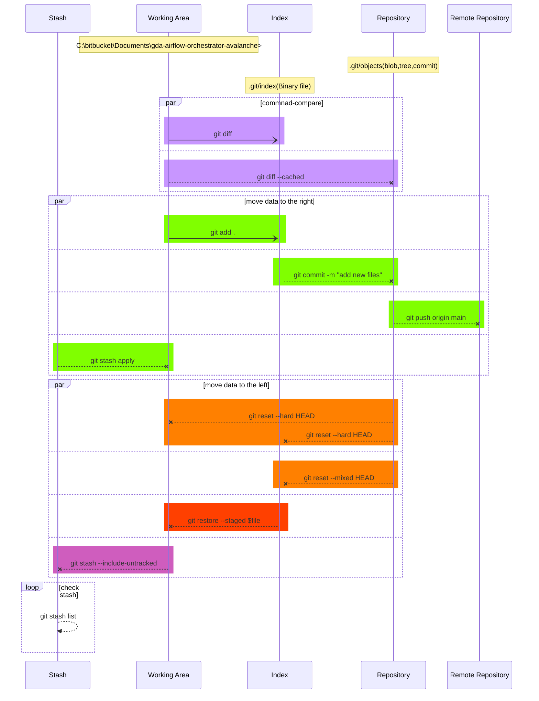

# Git and GitHub

## Git
### What Is Git?
* Popular source control system
* Distributed system
* Free and open-source
### Why Use Git?
* Fast
* Disconnected
* Powerful yet easy
* Branching
* Pull requests
### But… Why Not Git?
* Different
* Learning curve
* Tools
* Binary files

## GitHub
### What Is GitHub?
* Hosting service based on Git
* More than just source control for your code
* Free and paid options

## Getting Your Machine Ready
### Git Works Everywhere!
#### Windows
##### What you need
- Download Git from https://git-scm.com/downloads
- An editor Visual Studio Code
- GitHub account
#### Mac
#### Linux

## Foundations of Git
### Centralized Source Code Management

### Distributed Version Control

### The 5 Areas of Git
