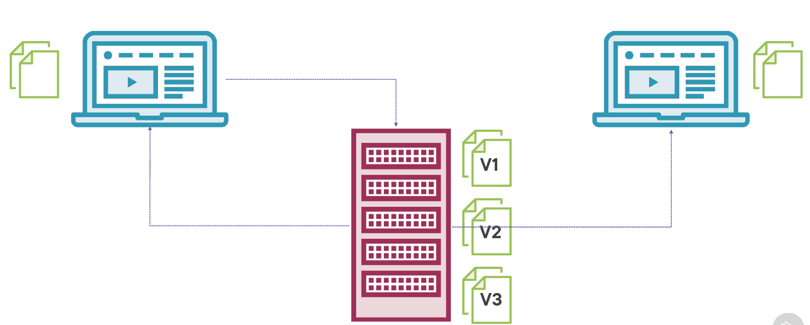
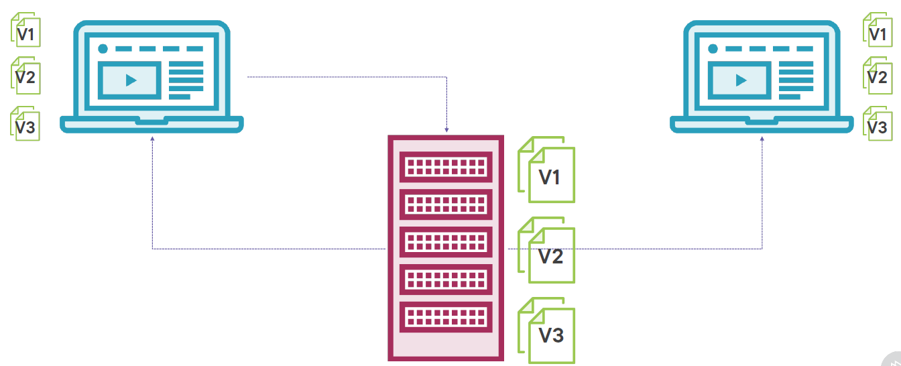

# Git and GitHub

## Git
### What Is Git?
* Popular source control system
* Distributed system
* Free and open-source
### Why Use Git?
* Fast
* Disconnected
* Powerful yet easy
* Branching
* Pull requests
### But… Why Not Git?
* Different
* Learning curve
* Tools
* Binary files


## GitHub
### What Is GitHub?
* Hosting service based on Git
* More than just source control for your code
* Free and paid options

## Getting Your Machine Ready
### Git Works Everywhere!
#### Windows
##### What you need
- Download Git from https://git-scm.com/downloads
- An editor Visual Studio Code
- GitHub account
#### Mac
#### Linux

## Foundations of Git
### Centralized Source Code Management

### Distributed Version Control


### The 5 Areas of Git


## Connection Options
### HTTPS
> Requires username and password
### SSH
> Easier to work with
#### 1. Install OpenSSH on your device.
There are 3 methods for installing OpenSSH on Microsoft Windows:

##### 1.1 Download and run the Git for Windows installer.
- Download and run the installer from https://gitforwindows.org/. The options at each step should be suitable. When you reach the step about choosing the SSH executable, ensure the bundled OpenSSH is selected.

- Once the installation is complete, open Git Bash from the Start menu.

- In the terminal, check that OpenSSH has been successfully installed by running the following command:

```
ssh -V
```

> The output should show the installed version of OpenSSH.

##### 1.2 Use winget to run the Git for Windows installer.
To install OpenSSH as part of Git for Windows with the Windows package manager winget:

- Check that winget is installed. Open PowerShell and run:

```
winget -v
```

- To install Git for Windows using winget install, run:

`winget install --id Git.Git -e --source winget`

- Once the installation is complete, open Git Bash from the Start menu.

In the terminal, check that OpenSSH has been successfully installed by running the following command:

`ssh -V`
The output should show the installed version of OpenSSH.

##### 1.3 Install the Windows version of OpenSSH.
`This procedure assumes Git is already installed and accessible in PowerShell. If Git is installed and not accessible in PowerShell, you may need to add Git to the PATH environmental variable.`

To install the Windows version of OpenSSH, follow the instructions in the Microsoft Docs Get Started with OpenSSH for Windows guide. Once OpenSSH is installed, you need to configure Git to use OpenSSH.

In PowerShell, check that OpenSSH has been successfully installed by running the following command:

`ssh -V`
The output should show the installed version of OpenSSH.

To find where ssh was installed, run Get-Command. For example:

`Get-Command ssh`

CommandType     Name        Version    Source
-----------     ----        -------    ------
Application     ssh.exe     8.1.0.1    C:\Windows\System32\OpenSSH\ssh.exe
To configure Git to use the Windows version of OpenSSH, update the SSH command with git config, such as:

`git config --global core.sshCommand C:/Windows/System32/OpenSSH/ssh.exe`

#### 2. Start the SSH service.
To allow git to use your SSH key, an SSH agent needs to be running on your device. The method for starting the SSH agent depends on how OpenSSH was installed.

Git for Windows users (including Winget-based Git installations)
From a git bash terminal, check if the SSH agent is running using the ps command. If the ssh-agent is already running, it should appear in the output, such as:

`$ ps -a | grep ssh-agent`
tkelly      3291  0.0  0.0   6028   464 ?        Ss   07:29   0:00 ssh-agent
To start the agent:

`eval $(ssh-agent)`
You may need to add this command to your ~/.bashrc to ensure the agent starts when you open a Git Bash terminal. 

#### 3. Create an SSH key pair.
To create an SSH key pair:

- Open a terminal and navigate to your home or user directory using cd, for example:

`cd ~/.ssh`
- Generate a SSH key pair using ssh-keygen, such as:

`ssh-keygen -t ed25519 -b 4096 -C "{username@emaildomain.com}" -f {ssh-key-name}`
> Where:
> - {username@emaildomain.com} is the email address associated with the Bitbucket Cloud account, such as your work email account.
> - {ssh-key-name} is the output filename for the keys. We recommend using a identifiable name such as bitbucket_work.

- When prompted to Enter passphrase, you can either provide a password or leave the password empty. If you input a password, you will be prompted for this password each time SSH is used, such as using Git command that contact Bitbucket Cloud (such as git push, git pull, and git fetch). Providing a password will prevent other users with access to the device from using your keys.

Once complete, ssh-keygen will output two files:

- {ssh-key-name} — the private key.

- {ssh-key-name}.pub — the public key.

These files will be stored in your user folder, such as C:\Users\<username>\.ssh\<ssh-key-name>.

#### 4. Add your key to the SSH agent.
To add the SSH key to your SSH agent (ssh-agent):

- Run the following command, replacing the {ssh-key-name} with the name of the private key:

`ssh-add ~/.ssh/{ssh-key-name}`
To ensure the correct SSH key is used when connecting to Bitbucket, update or create your SSH configuration file (~/.ssh/config) with the following settings:

```
Host bitbucket.org
  AddKeysToAgent yes
  IdentityFile ~/.ssh/{ssh-key-name}
```
> Where {ssh-key-name} is the location of the private key file once it has been added to the ssh-agent.
#### 5. Provide Bitbucket Cloud with your public key.
To add an SSH key to your user account:

- At bitbucket.org, select your avatar (Your profile and settings) from the navigation bar at the top of the screen.

- Under Settings, select Personal settings.

- Under Security, select SSH keys.

- Select Add key.

- In the Add SSH key dialog, provide a Label to help you identify which key you are adding. For example, Work Laptop <Manufacturer> <Model>. A meaning full label will help you identify old or unwanted keys in the future.

- Open the public SSH key file (public keys have the .pub file extension) in a text editor. The public key should be in the .ssh/ directory of your user (or home) directory. The contents will be similar to:

`ssh-ed25529 LLoWYaPswHzVqQ7L7B07LzIJbntgmHqrE40t17nGXL71QX9IoFGKYoF5pJKUMvR+DZotTm user@example.com`

- Copy the contents of the public key file and paste the key into the Key field of the Add SSH key dialog.

- Select Add key.

> - If the key is added successfully, the dialog will close and the key will be listed on the SSH keys page.

> - If you receive the error That SSH key is invalid, check that you copied the entire contents of the public key (.pub file).

#### 6. Check that your SSH authentication works.
To test that the SSH key was added successfully, open a terminal on your device and run the following command:

```
ssh -T git@bitbucket.org
```
If SSH can successfully connect with Bitbucket using your SSH keys, the command will produce output similar to:
> authenticated via ssh key.
>
>You can use git to connect to Bitbucket. Shell access is disabled